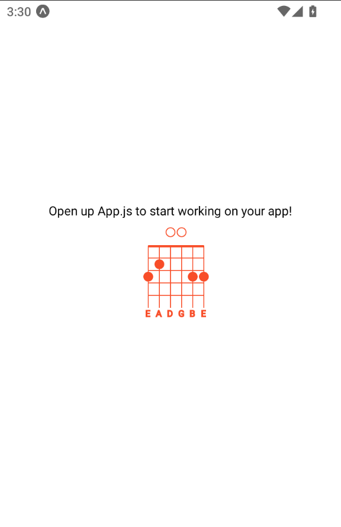

# React Native Chord Charts

## Introduction

This package allows rendering guitar chord charts as SVG into your react native app. It uses [react-native-svg](https://www.npmjs.com/package/react-native-svg) to render the charts.

## Screenshots

* Example **G** chord chart:

  

## Getting started

If you wish you can use the example available here. It's an expo app.

### 1. Instalation

First run the following commands to instal the package:

```sh
# Run this command if you use npm or...
npm i --save react-native-chord-charts

# Run this one if you use yarn
yarn add react-native-chord-charts
```

### 2. Basic usage

Import the component and invoke it on TSX section and its all done your component is rendering.
Obs. The chord chart is rendered based on chord key example: **C**, **D**, **G#m**...

```ts
import { View } from 'react-native';
import ChordChart from 'react-native-chord-charts';

const MyComponent = () => {
  return (
    <View>
      <ChordChart
        key="C"
        color="#000000"
      />
    </View>
  );
};

export default MyComponent;
```

### 3. Component available properties

| Property   | Default Value                  | Description                         | Is Required? |
|------------|--------------------------------|-------------------------------------|--------------|
| width      | 100                            | Chart width                         | no           |
| height     | 120                            | Chart height                        | no           |
| showTuning | false                          | Display the chord keys on svg chart | no           |
| tuning     | ['E', 'A', 'D', 'G', 'B', 'E'] | Intrument tuning (Guitar)           | no           |
| chordKey   |                                | Guitar chord key example: G#m       | yes          |
| color      | #8257E5                        | Chord chart svg render color        | no           |

## Author

* [Mazurco066](https://github.com/Mazurco066).

## Credits

The chord chart component was created based on the component developed in the app mentioned below:

* [OpenChord App](https://github.com/artutra/OpenChord) - Created by [Artur Miranda](https://github.com/artutra).

## License

This project is licensed under the ISC License. Check the [LICENSE](LICENSE) file for further details.
